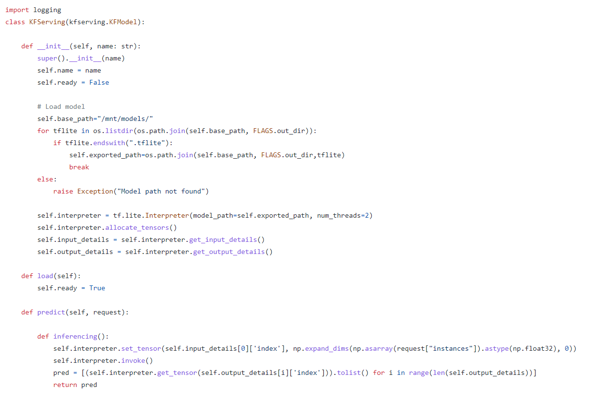
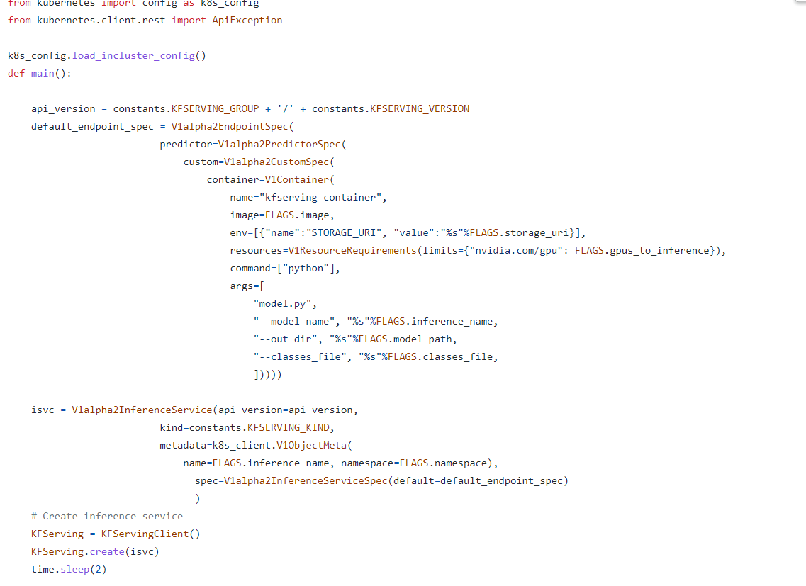
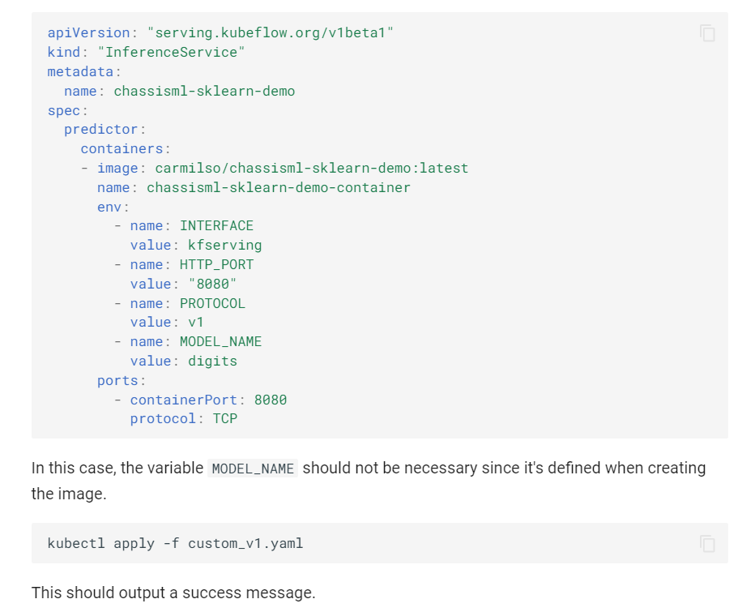

# Model deployment on Kubeflow using KFserving

Model can be served or deployed on Kubeflow using either KFserving or TFserving. If models are generated from Tensorflow based model, TFserving can be used but KFserving can be used for models from any framework including tensorflow.

## **Step 1**:

Collect your trained model and load it into a storage resource running on the cluster in a particular namespace. The storage can be  NFS, PVC or object storage like Minio. Other storage types also can be used.

## **Step 2**:

Deploy KFserving model server on cluster. This can be done in 2 ways:

- Deploy out-of-box available model servers such as TFserving, TorchServe as a CRD (Custom resource definition). Refer https://github.com/kserve/kserve/blob/master/docs/samples/README.md.

- Create custom model-server, create a Docker image for it and deploy it on cluster. Sample of custom model-server - https://github.com/CiscoAI/cisco-kubeflow-starter-pack/tree/master/apps/computer-vision/object-detection/onprem/pipeline/components/v2/model-server and in a code snippet in the screenshot below:



## **Step 3**:

Create an Endpoint Specification embedding the custom model server's image and create an Inference service specification using YAML config or Kfserving SDK.



## **Step 4**:

Apply the inference service configuration using KFserving client and create an Inference service through YAML or SDK.

Below is an example of inference service YAML.




Once the model is found in the input model path, a Prediction URL is returned by the inference service. This prediction URL can be POSTed with requests of input data / test data, and predicted results can be obtained.

The predicted URL may be of the format `https://<inference name>/v1/models/<model name>:predict`.

```
kubectl get inferenceservice -n kubeflow
NAME                     URL                                                                                   READY   DEFAULT TRAFFIC   CANARY TRAFFIC   AGE
kfserving-custom-model   http://kfserving-custom-model.kubeflow.example.com/v1/models/kfserving-custom-model   True    100                                3h28m
sklearn-iris             http://sklearn-iris.kubeflow.example.com/v1/models/sklearn-iris                       True    100                                138m
sklearn-reg              http://sklearn-reg.kubeflow.example.com/v1/models/sklearn-reg                         True    100                                10m
```


## **Step 5**:

The returned prediction URL can be used to test a single input data or a set of input data. For a single input, post it using `curl` command, or for a set of input data, one way is to use `requests` Python module and post requests to it.

Input using curl command through following steps:

```
export INGRESS_HOST=$(minikube ip)
export INGRESS_PORT=$(kubectl -n istio-system get service istio-ingressgateway -o jsonpath='{.spec.ports[?(@.name=="http2")].nodePort}')
export SERVICE_NAME=chassisml-sklearn-demo
export MODEL_NAME=digits
export SERVICE_HOSTNAME=$(kubectl get inferenceservice ${SERVICE_NAME} -o jsonpath='{.status.url}' | cut -d "/" -f 3)
```
```
import json
import base64 as b64
instances = [[1,2,3,4],[5,6,7,8]]
input_dict = {'instances': [b64.b64encode(str(entry).encode()).decode() for entry in instances]}
json.dump(input_dict,open('kserve_input.json','w'))
```
```
curl -H "Host: ${SERVICE_HOSTNAME}" "http://${INGRESS_HOST}:${INGRESS_PORT}/v1/models/${MODEL_NAME}:predict" -d@kfserve_input.json | jq
```


